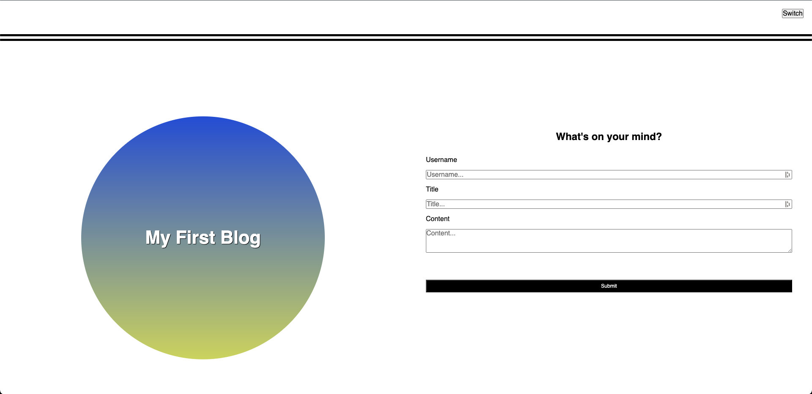
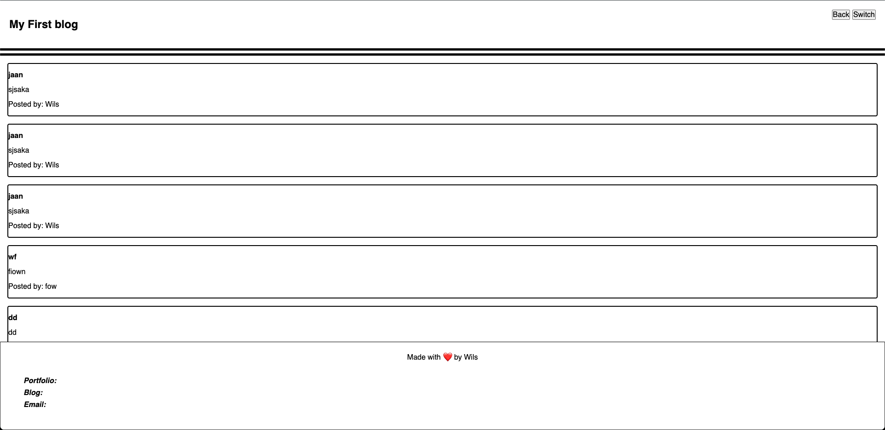

# Week-4-Challange

## My Blog

Title: My First Blog

Description:
In this project, I created a website where visitors can create blog post. I used HTML to build the main page with the form for user input, and secondary blog page where the blog post are posted; I used 3 Javascript files to build the logic + build and populate the blog post from the user input into the form; and I used 3 css files for the form, blog, and overall styling.

How to Run:
Please click on deployed link below and you will be prompted to the main page of the application. You can write your own blog post by entering a 'Username', a 'Title' for your post, and the 'Content' of your blog post in each respective section of the form and then pressing submit. You can make multiple post onto the Blog page and scroll through them (as demonstrated), the posts are saved in your local storage. You can also try the LightMode and DarkMode feature on the top right as well marked by the switch button.

Github Repository : https://github.com/wilsacker/Week-4-Challange Deployed Link : https://wilsacker.github.io/Week-4-Challange/